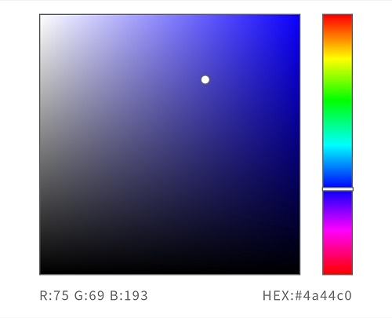

# we-color-picker

微信小程序拾色器（颜色选择器）组件☕

> ❗❗ 由于本人水平的原因，在使用该组件时的一些设置限制的比较严格，请务必认真阅读本文档。

## 查看DEMO


## 安装使用

将项目中src目录下的全部文件拷贝到/components/color-picker中，在使用该组件的页面对应json文件中添加：
```json
"usingComponents": {
    "color-picker":"/components/color-picker/color-picker"
}
```
具体如何引入组件请参考[微信小程序官方文档](https://developers.weixin.qq.com/miniprogram/dev/framework/custom-component/wxml-wxss.html)

## 截图示例

仿照PS的色相立方体制作而成



## WXML

```HTML
<color-picker class="color-picker" colorData="{{colorData}}" rpxRatio="{{rpxRatio}}" bindchangecolor="onChangeColor"></color-picker>
```

## 可能导致错误的样式问题
❗❗ color-picker的祖先元素切勿使用定位，否则将导致拾色器选择点位置错误。

## 参数

```javascript
colorData: {
    //基础色相，即左侧色盘右上顶点的颜色，由右侧的色相条控制
    hueData: {
        colorStopRed: 255,
        colorStopGreen: 0,
        colorStopBlue: 0,
    },
    //选择点的信息（左侧色盘上的小圆点，即你选择的颜色）
    pickerData: {
        x: 0, //选择点x轴偏移量
        y: 480, //选择点y轴偏移量
        red: 0, 
        green: 0,
        blue: 0, 
        hex: '#000000'
    },
    //色相控制条的位置
    barY: 0
},
rpxRatio: 1 //此值为你的屏幕CSS像素宽度/750，单位rpx实际像素


//设置rpxRatio
wx.getSystemInfo({
    success(res) {
        _this.setData({
            rpxRatio: res.screenWidth / 750
        })
    }
})
```

## 事件

```javascript
//选择改色时触发（在左侧色盘触摸或者切换右侧色相条）
onChangeColor(e) {
    //e.detail.colorData与参数中的colorData一致
}
```

## 多个拾色器的情况

### WXML
```HTML
<color-picker data-id="0" class="color-picker" colorData="{{colorData0}}" rpxRatio="{{rpxRatio}}" bindchangecolor="onChangeColor"></color-picker>
<color-picker data-id="1" class="color-picker" colorData="{{colorData1}}" rpxRatio="{{rpxRatio}}" bindchangecolor="onChangeColor"></color-picker>
<color-picker data-id="2" class="color-picker" colorData="{{colorData2}}" rpxRatio="{{rpxRatio}}" bindchangecolor="onChangeColor"></color-picker>
<!--More...-->
```

### JS
```javascript
//设置多个参数即可
colorData0: {
    //...
},
colorData1: {
    //...
},
colorData2: {
    //...
},
//More...

onChangeColor(e) {
    //这里我使用了dataset来存储标志，用来判断时哪个拾色器发生变化
    const index = e.target.dataset.id
    this.setData({
        [`colorData${index}`]: e.detail.colorData
    })
}
```

## 遇到问题?

[Issue](https://github.com/KirisakiAria/we-color-picker/issues)

wechat: thereshegoes 

email: xiaoli350791904@hotmail.com
